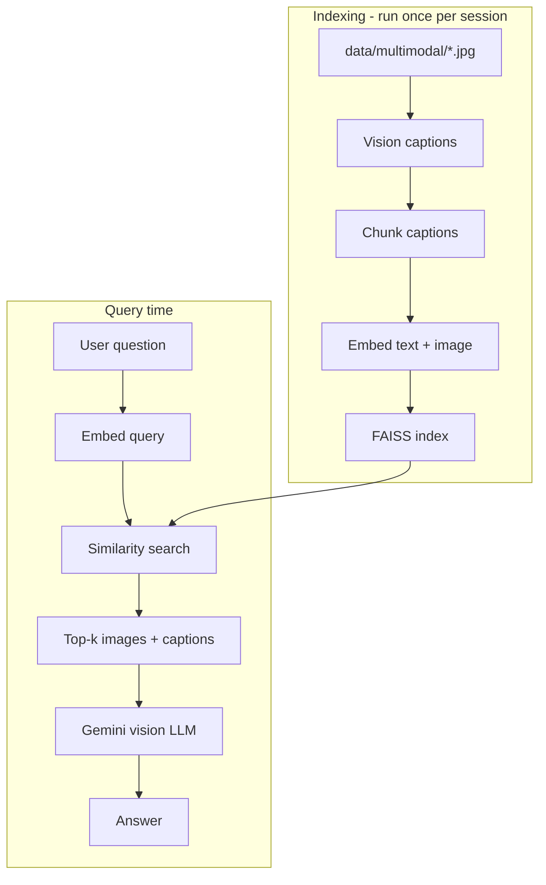

# Multimodal RAG Pipeline — Step-by-Step Guide

This document explains **`multimodal-rag-pipeline.ipynb`** in plain language. It follows the same 7-step idea as the text notebook, but your data is **images + captions** in `data/multimodal/`.

---

## What is multimodal RAG?

**Multimodal** = more than text (here: **images + text**).

| Phase | Text RAG | Multimodal RAG (this notebook) |
|-------|----------|--------------------------------|
| Data | Web page HTML | JPG/PNG in `data/multimodal/` |
| What gets embedded | Text chunks | Caption text **+** image bytes (if embedding-2) |
| Retrieval | Nearest text chunks | Nearest image+caption records |
| Generation | Text-only LLM | **Vision** LLM sees retrieved **images** + captions |

```
Your images on disk (data/multimodal/)
    → Caption each image (vision or manual)
    → Embed caption (+ image if model supports it)
    → FAISS index
    → User asks question
    → Retrieve top images
    → Gemini looks at those images and answers
```

---

## Frameworks & libraries used

| Piece | Library | Role |
|--------|---------|------|
| Orchestration | **LangChain** | `Document`, messages, FAISS wrapper |
| Chat / vision | **langchain-google-genai** → `ChatGoogleGenerativeAI` | Gemini reads text **and** images |
| Embeddings | **google-genai** SDK (custom class) | `client.models.embed_content` with text + image parts |
| Text splitting | **RecursiveCharacterTextSplitter** | Split long captions (optional for short captions) |
| Vector store | **FAISS** | Same as text pipeline |
| Images on disk | **pathlib** | `data/multimodal/*.jpg` |
| Vision captions | **langchain_core.messages.HumanMessage** | Send image as base64 to Gemini |
| Config | **python-dotenv** | `.env` for API keys |

Extra packages: `google-genai`, `Pillow` (listed in `requirements.txt`).

---

## Models used

| Purpose | Default | Env variable |
|---------|---------|--------------|
| **Chat / vision answers** | `gemini-2.5-flash-lite` | `GEMINI_MODEL` |
| **Multimodal embeddings** | `models/gemini-embedding-2-preview` | Set in code via `resolve_multimodal_embed_model()` |
| **Text-only embeddings (fallback)** | `models/gemini-embedding-001` | Only if `FORCE_GEMINI_EMBEDDING_001=true` |

### Why two embedding models?

| Model | Images in embed API? | In this notebook |
|-------|----------------------|------------------|
| `gemini-embedding-001` | **No** (text only) | Caption-only index; `Image+text embedding: False` |
| `gemini-embedding-2-preview` | **Yes** | Caption + image pixels in one vector; `True` |

If you pass images to `embedding-001`, the API drops them → **"The text content is empty"** error. The notebook forces **embedding-2** unless you set `FORCE_GEMINI_EMBEDDING_001=true`.

---

## Where your images live

```
rag_practice/
  data/
    multimodal/
      cat.jpg
      cats.jpg
      iphone.jpg
      sunflower.jpg
      domino.jpg
      Auto rides.jpg
```

Each file becomes one (or more) **`Document`**:

```python
Document(
    page_content="A bright yellow sunflower in a field.",  # caption → used for search
    metadata={
        "image_path": "C:/.../data/multimodal/sunflower.jpg",
        "filename": "sunflower.jpg",
        "source": "local:sunflower",
    },
)
```

**FAISS stores vectors, not image files.** At answer time the notebook opens `image_path` again and sends bytes to Gemini.

---

## 7 steps (cell by cell)

### Step 0 — Environment

1. **`load_dotenv()`** — load API keys from `.env`.
2. **Config cell** — sync keys, rate limits, `MULTIMODAL_DATA_DIR=data/multimodal`.
3. **`llm = ChatGoogleGenerativeAI(...)`** — model for captions (Step 1) and final answers (Step 7).
4. **Smoke test** — one text prompt to confirm the key works.

---

### Step 1 — Load

**Goal:** Build `raw_documents` — one entry per image file.

1. **List images** in `DATA_DIR` (`.jpg`, `.png`, `.webp`, `.gif`).
2. **Caption** each image:
   - **`IMAGE_CAPTIONS`** — you write exact caption per filename (optional).
   - **`AUTO_CAPTION_WITH_VISION=true`** (default) — Gemini describes the image in one sentence.
   - Else — guess from filename (`sunflower.jpg` → `"Photo related to sunflower."`).

```python
def caption_image_with_vision(image_path):
    # Sends image + instruction to llm
    # Returns description string → page_content
```

**Why vision captions?** Better retrieval than generic filenames.

**Re-run Step 1** whenever you add new files to `data/multimodal/`.

---

### Steps 2 & 3 — Chunking & overlapping

```python
text_splitter = RecursiveCharacterTextSplitter(chunk_size=200, chunk_overlap=40)
documents = text_splitter.split_documents(raw_documents)
```

| Setting | Value | Why |
|---------|-------|-----|
| `chunk_size` | 200 | Captions are short; splitting rarely needed |
| `chunk_overlap` | 40 | Keeps context between chunks if caption is long |

For 6 images with one sentence each, you usually still have **6 chunks**.

---

### Step 4 — Embed (multimodal)

**Class: `MultimodalGeminiEmbeddings`**

```python
def resolve_multimodal_embed_model():
    # Default: models/gemini-embedding-2-preview
    # Unless FORCE_GEMINI_EMBEDDING_001=true
```

**For each document:**

1. Build text part: `types.Part.from_text(caption)`.
2. If embedding-2: add `types.Part.from_bytes(image bytes)`.
3. Call `client.models.embed_content(..., task_type="RETRIEVAL_DOCUMENT")`.
4. Get back a vector (list of floats).

**For a user question:**

- `embed_query` with `task_type="RETRIEVAL_QUERY"`.

**Rate limiting:** pause between documents (same idea as text notebook).

Print lines:

```
Multimodal embed model: models/gemini-embedding-2-preview
Image+text embedding: True
```

---

### Step 5 — Index (FAISS)

```python
text_embedding_pairs = [(doc.page_content, vector), ...]
vectorstore = FAISS.from_embeddings(text_embedding_pairs, embeddings, metadatas=metadatas)
```

**Important:** Pairs must be **`(text, vector)`**, not `(vector, Document)`.

`metadatas` keeps `image_path` so retrieval knows which file to open.

---

### Step 6 — Retrieve

```python
query = "yellow sunflower flower"
retrieved = vectorstore.similarity_search_with_score(query, k=3)
```

| Concept | Meaning |
|---------|--------|
| **similarity_search** | Embed query → compare to all indexed vectors |
| **score** | Distance (lower often = closer, depending on FAISS metric) |
| **k** | How many top results to return |

**Critical rule:** You can only retrieve images **you indexed**. No `dog.jpg` in folder → a "dog" query returns the **closest** thing (e.g. cats).

Optional cell: `IPython.display.Image` shows retrieved pictures.

---

### Step 7 — Generate (vision RAG)

```python
def answer_with_multimodal_rag(question, k=2):
    docs = vectorstore.similarity_search(question, k=k)
    # Build HumanMessage with:
    #   - text: question + captions
    #   - image_url: base64 for each retrieved file
    response = llm.invoke([HumanMessage(content=parts)])
```

**Difference from text RAG:**

- Text RAG: only **words** from chunks go to the model.
- Multimodal: model **sees the actual images** plus captions.

Example questions (match your files):

- `"Which retrieved image shows a cat?"`
- `"Which image shows a smartphone or iPhone?"`

---

## End-to-end flow (diagram)



---

## Environment variables

| Variable | Purpose |
|----------|---------|
| `GEMINI_API_KEY` | Required |
| `GEMINI_MODEL` | Chat / vision model |
| `MULTIMODAL_DATA_DIR` | Default `data/multimodal` |
| `AUTO_CAPTION_WITH_VISION` | `true` = auto-describe images on load |
| `GEMINI_EMBED_MAX_CHUNKS` | Cap number of indexed items |
| `FORCE_GEMINI_EMBEDDING_001` | `true` = caption-only embeddings |
| `GEMINI_EMBED_API_PAUSE_SEC` | Pause between embed API calls |

---

## How to add your own images

1. Copy files to `data/multimodal/`.
2. (Optional) Add captions in `IMAGE_CAPTIONS` dict in notebook.
3. Restart kernel → **Run All** from Step 0.
4. Re-index through Step 5 before asking new questions.

---

## Text RAG vs multimodal — quick comparison

| | `rag-pipeline.ipynb` | `multimodal-rag-pipeline.ipynb` |
|--|----------------------|----------------------------------|
| Source | URL (HTML) | Local images |
| Loader | `WebBaseLoader` | `load_images_from_dir` |
| Embed API | LangChain `GoogleGenerativeAIEmbeddings` | Custom + `google-genai` |
| Default embed model | `gemini-embedding-001` | `gemini-embedding-2-preview` |
| Generation | Text context only | Images + text to Gemini |
| Best for | Docs, articles, web pages | Photos, diagrams, product images |

---

## Common issues

| Symptom | Cause | Fix |
|---------|--------|-----|
| Wrong animal/object retrieved | No matching image in folder | Add image; fix captions; re-index |
| `Image+text embedding: False` | embedding-001 or old kernel | Restart; re-run Step 4 |
| Empty text embed error | Image sent to text-only embed model | Use embedding-2 (default in code) |
| `TypeError: Document has no len()` | Wrong FAISS pair order | Use `(text, vector)` pairs |
| 403 on download URLs | N/A for local images | Use `data/multimodal/` only |

---

## One-sentence summary

**Scan your images → caption them (vision or manual) → embed caption + image into FAISS → search with a text question → Gemini answers while looking at the retrieved images.**

For the text-only pipeline, see **[rag-pipeline-explained.md](./rag-pipeline-explained.md)**.
